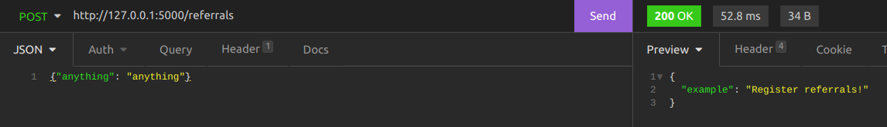

# Desafio para novos membros na Simbiose em Backend: 
## Python e SQAlchemy

Desenvolver uma API REST para registro de indicações na Simbiose. Neste repositório está
disponibilizado a base inicial do código, com uma API em Flask, funcional e com os endpoints
definidos porém sem nenhuma resposta válida. 
As seguintes tecnologias devem ser utilizadas: Python, MySQL e SQL Alchemy.
O sistema deve ser capaz de realizar as seguintes ações:
- Registrar Equipes(times) `(POST /teams)`
- Registrar Funcionários (e possibilitar vincular a uma equipe) `(POST /employees)`
- Registrar Indicações. `(POST /recommendations)`
- Retornar uma lista de equipes e respectivos funcionários `(GET /teams)`
- Retornar uma lista de indicações `(GET /recommendations)`
- Retornar quais funcionários realizaram indicações `(GET /recommendations/employees)`


### Para utilizar a API
Para rodar o servidor execute o comando abaixo no terminal dentro da pasta raíz do projeto:
```
python3 main.py
```
A seguinte mensagem deve aparecer:
```
Running on http://127.0.0.1:5000/ (Press CTRL+C to quit)
```

Pronto, sua API está rodando no endereço `http://127.0.0.1:5000/`. Utilizando o Insomnia ou a sua
ferramenta de preferência você pode fazer requisições nos endpoins:


Agora, a partir do código inicial da API, desenvolva seu sistema. A modelagem do banco de
dados faz parte da solução que deve ser entregue, sendo assim você tem liberdade de escolher as 
tabelas que serão criadas.


**Atenção**: O objetivo não é aprender Flask, o Flask está sendo utilizado apenas para que
o desafio fique o mais simples e objetivo possível. Não é uma tecnologia utilizada na Simbiose.
